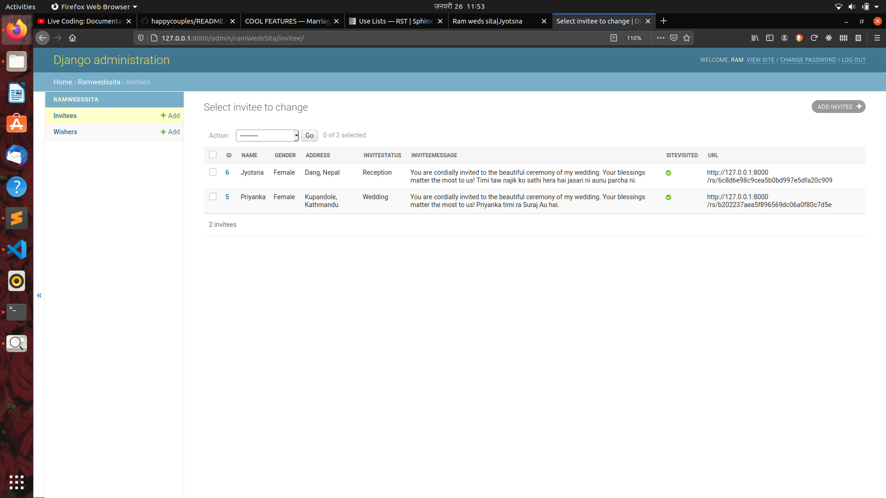
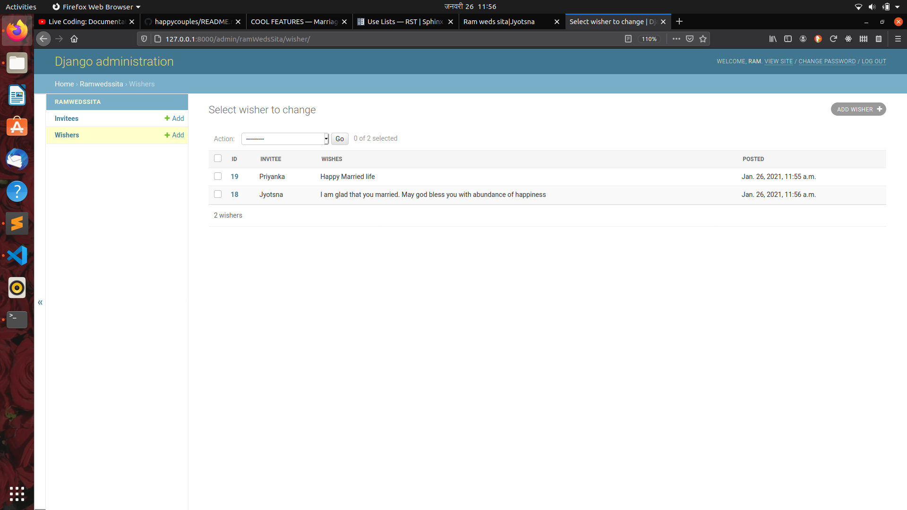
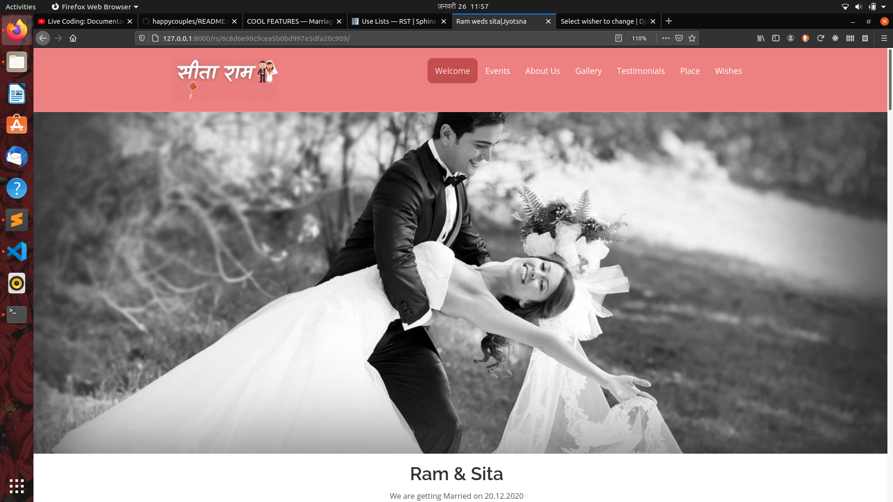
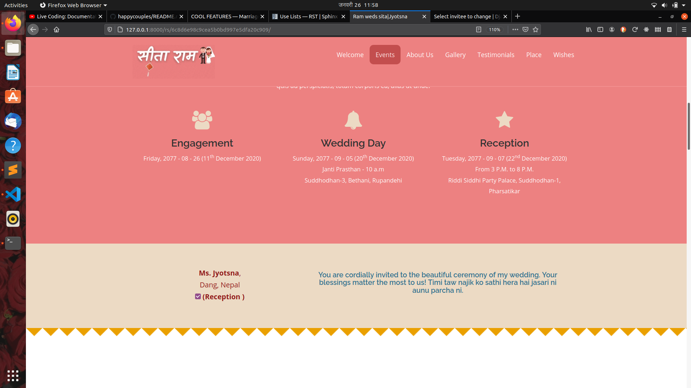
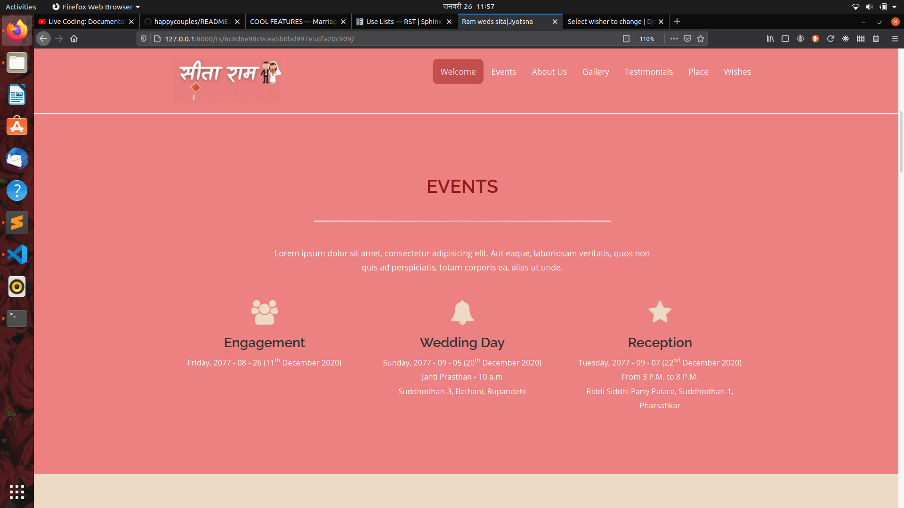
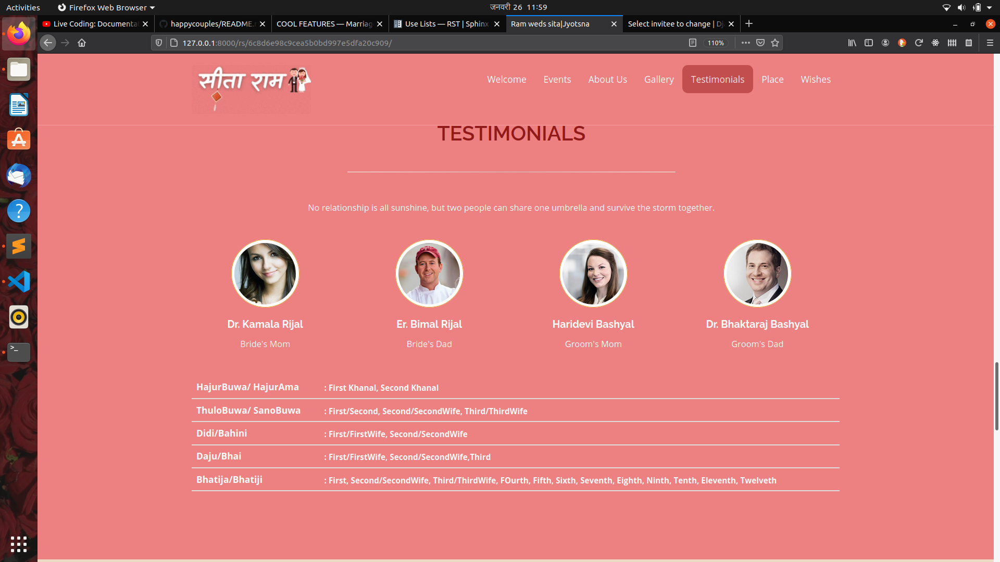
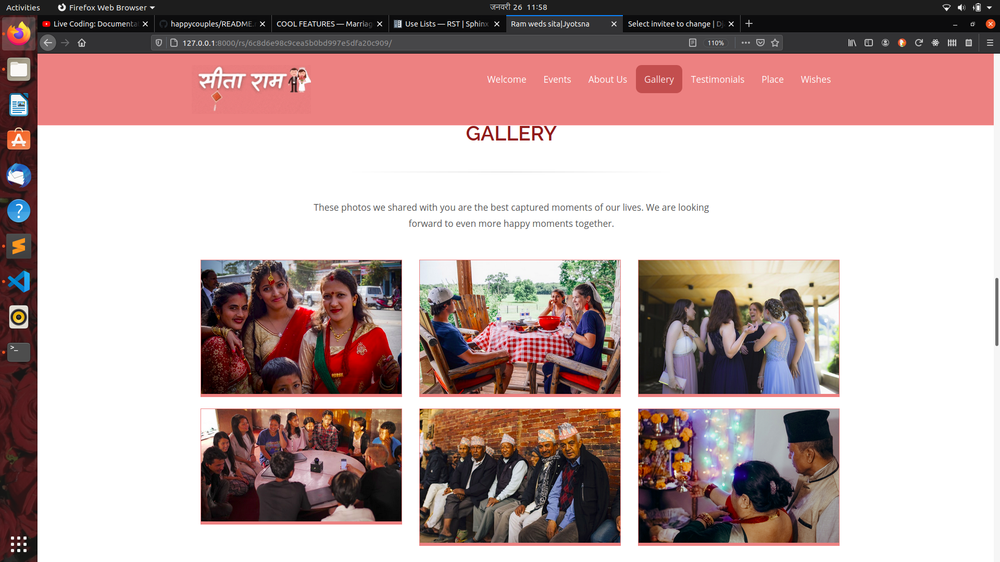
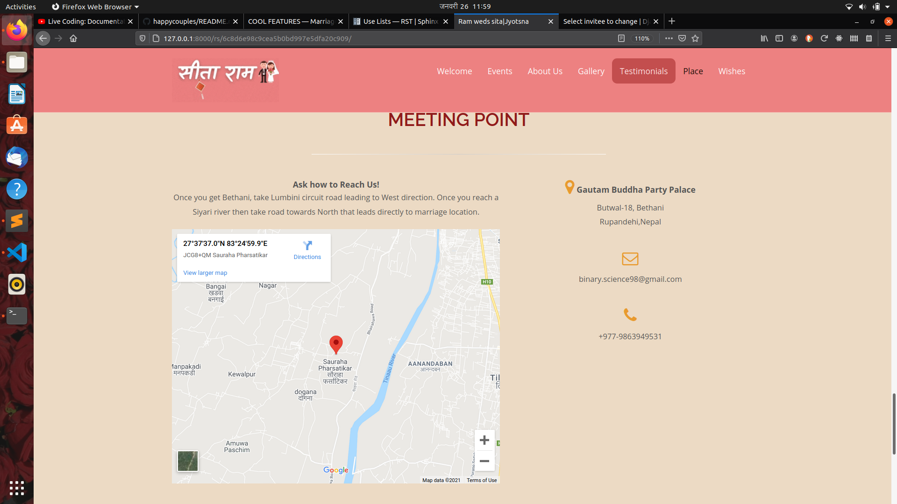
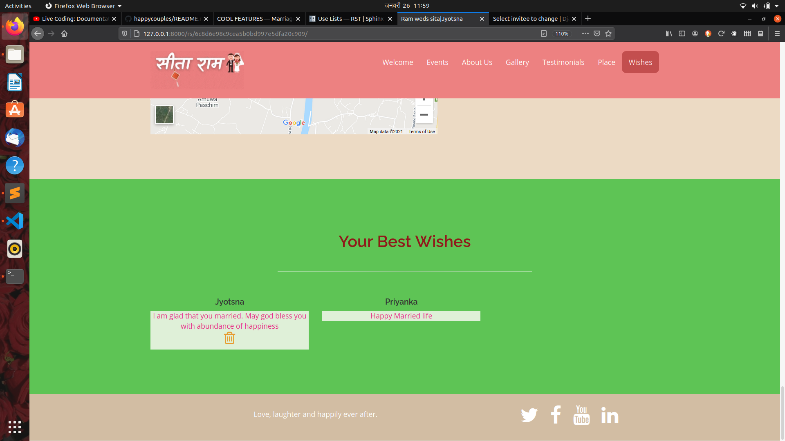

===================
Project Screenshots
===================

.. comment
    This is a comment for image 
    .. image:: picture.jpeg
        :height: 100px
        :width: 200 px
        :scale: 50 %
        :alt: alternate text
        :align: right  ("top/middle/bottom/left/center/right")

**ADMIN PANEL**
===============

   
   fig 1. Invitee details

   
   fig 2. Invitee's wishes 

**FRONTEND**
============

   
   fig 3. **Welcome** section of invitation

   
   fig 4. **Personal invitation message for guest**

   
   fig 5. **Event Section** of invitation

   
   fig 6. **Testimonial** Section of invitation

   
   fig 7. **Gallery** Section of invitation

.. figure:: images/hc-fe-about-us.png
   :alt: Screenshot showing about bride and groom
   
   fig 8. **About us** section of invitation

   
   fig 9. **Place** section of invitation

   
   fig 10. **Wishes**  section of invitation