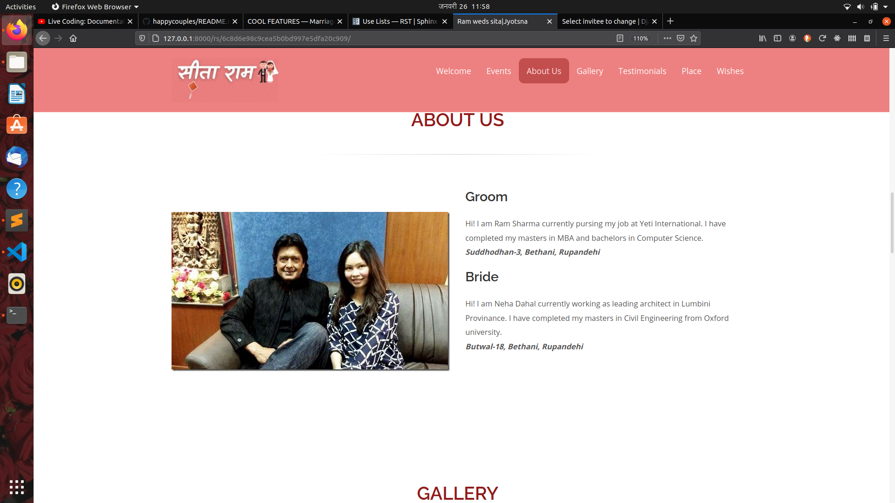

===================
Project Screenshots
===================

.. comment
    This is a comment for image 
    .. image:: picture.jpeg
        :height: 100px
        :width: 200 px
        :scale: 50 %
        :alt: alternate text
        :align: right  ("top/middle/bottom/left/center/right")

**ADMIN PANEL**
===============

   
   fig 1. Invitee details

.. figure:: images/hc-db-wisher.png
   :alt: Screenshot showing all the wishes by invitee
   
   fig 2. Invitee's wishes 

**FRONTEND**
============
.. figure:: images/hc-fe-welcome.png
   :alt: Screenshot showing Welcome section of invitation
   
   fig 3. **Welcome** section of invitation

.. figure:: images/hc-fe-msg.png
   :alt: Screenshot showing personal invitation message for guest
   
   fig 4. **Personal invitation message for guest**

.. figure:: images/hc-fe-events.png
   :alt: Screenshot showing Events
   
   fig 5. **Event Section** of invitation

.. figure:: images/hc-fe-testimonial.png
   :alt: Screenshot showing testimonials
   
   fig 6. **Testimonial** Section of invitation

   
   fig 7. **Gallery** Section of invitation

   
   fig 8. **About us** section of invitation

.. figure:: images/hc-fe-meet-point.png
   :alt: Screenshot showing the location of ceremony
   
   fig 9. **Place** section of invitation

.. figure:: images/hc-fe-wishes.png
   :alt: Screenshot showing all the wishes by invitees
   
   fig 10. **Wishes**  section of invitation